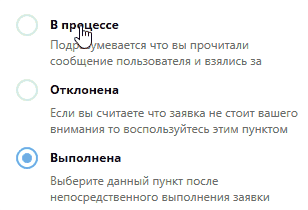

# RadioButton WPF Style

This is copy of Telegram RadioButton style for WPF projects. So, looks like:



# How to use
For example u can add to ur App.xaml project file (after Application.Resources)
```xml
  <Style x:Key="RadioButtonStyle"
               TargetType="RadioButton">
            <Setter Property="SnapsToDevicePixels"
                    Value="true" />
            <Setter Property="OverridesDefaultStyle"
                    Value="true" />
            <Setter Property="BorderThickness"
                    Value="1" />
            <Setter Property="Height"
                    Value="20" />
            <Setter Property="Margin"
                    Value="5" />
            <Setter Property="FocusVisualStyle"
                    Value="{x:Null}" />
            <Setter Property="Template">
                <Setter.Value>
                    <ControlTemplate TargetType="RadioButton">
                        <BulletDecorator Margin="-5">
                            <BulletDecorator.Bullet>
                                <Grid Margin="1,5,-23,-27">
                                    <Ellipse Name="EllipseMain"
                                             Grid.Column="0"
                                             Grid.ColumnSpan="3"
                                             Grid.Row="0"
                                             Grid.RowSpan="3"
                                             Fill="Transparent"
                                             StrokeThickness="2"
                                             Stroke="LightGray" />
                                    <Ellipse Name="CheckMark"
                                             Grid.Column="1"
                                             Grid.Row="1"
                                             Opacity="1"
                                             Fill="#FF4EB3EE"
                                             Margin="6"
                                             Width="Auto" />
                                </Grid>
                            </BulletDecorator.Bullet>
                            <VisualStateManager.VisualStateGroups>
                                <VisualStateGroup x:Name="CommonStates">
                                    <VisualState x:Name="Disabled">
                                        <Storyboard>
                                            <DoubleAnimation Storyboard.TargetName="CheckMark"
                                                             Storyboard.TargetProperty="Opacity"
                                                             Duration="0:0:0.3"
                                                             To="6" />
                                            <ColorAnimation Storyboard.TargetName="EllipseMain"
                                                            Storyboard.TargetProperty="(Ellipse.Stroke).(SolidColorBrush.Color)"
                                                            To="#FF4EB3EE"
                                                            Duration="0:0:0.3" />
                                        </Storyboard>
                                    </VisualState>
                                </VisualStateGroup>
                                <VisualStateGroup x:Name="CheckStates">
                                    <VisualState x:Name="Checked">
                                        <Storyboard>
                                            <ThicknessAnimation Storyboard.TargetName="CheckMark"
                                                                Storyboard.TargetProperty="Margin"
                                                                Duration="0:0:0.2"
                                                                To="6" />
                                        </Storyboard>
                                    </VisualState>
                                    <VisualState x:Name="Unchecked">
                                        <Storyboard>
                                            <ThicknessAnimation Storyboard.TargetName="CheckMark"
                                                                Storyboard.TargetProperty="Margin"
                                                                Duration="0:0:0.2"
                                                                To="11" />
                                            <ColorAnimation Storyboard.TargetName="EllipseMain"
                                                            Storyboard.TargetProperty="(Ellipse.Stroke).(SolidColorBrush.Color)"
                                                            To="LightGray"
                                                            Duration="0:0:0.3" />
                                        </Storyboard>
                                    </VisualState>
                                    <VisualState x:Name="Indeterminate">
                                        <Storyboard>
                                            <ThicknessAnimation Storyboard.TargetName="CheckMark"
                                                                Storyboard.TargetProperty="Margin"
                                                                Duration="0:0:0.3"
                                                                To="6" />
                                            <ColorAnimation Storyboard.TargetName="EllipseMain"
                                                            Storyboard.TargetProperty="(Ellipse.Stroke).(SolidColorBrush.Color)"
                                                            To="#FF4EB3EE"
                                                            Duration="0:0:0.3" />
                                        </Storyboard>
                                    </VisualState>
                                </VisualStateGroup>
                            </VisualStateManager.VisualStateGroups>
                            <ContentPresenter Margin="13,7,0,7"
                                              HorizontalAlignment="Left"
                                              VerticalAlignment="Center"
                                              RecognizesAccessKey="True"
                                              Width="295" />
                        </BulletDecorator>
                        <ControlTemplate.Triggers>
                            <Trigger Property="IsFocused"
                                     Value="True">
                                <Setter TargetName="EllipseMain"
                                        Property="Stroke"
                                        Value="#FF4EB3EE" />
                            </Trigger>
                            <Trigger Property="IsFocused"
                                     Value="False">
                                <Setter TargetName="EllipseMain"
                                        Property="Stroke"
                                        Value="#FF4EB3EE" />
                            </Trigger>
                        </ControlTemplate.Triggers>
                    </ControlTemplate>
                </Setter.Value>
            </Setter>
        </Style>
```

And then add this to RadioButton property
```xml
Style="{StaticResource RadioButtonStyle}"
```

Ready!
